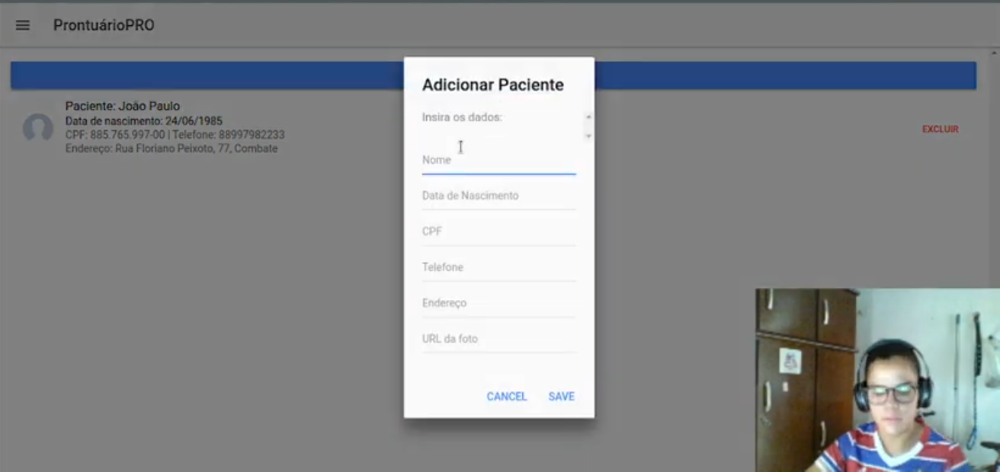

# 🩺 ProntuárioPRO - Prontuário e Agendamento

Bem-vindo ao *ProntuárioPRO*, uma solução completa para médicos gerenciarem prontuários de pacientes e agendamentos de consultas de forma prática e eficiente. Desenvolvido utilizando o framework Ionic, este app oferece uma interface intuitiva e ferramentas essenciais para o dia a dia de um profissional de saúde.

## 📱 Funcionalidades

- *Prontuário Eletrônico*: Acesse, edite e visualize informações completas dos pacientes, incluindo histórico de consultas, tratamentos e exames.
- *Agendamento de Consultas*: Organize suas consultas com facilidade, visualizando e gerenciando horários disponíveis e ocupados.
- *Busca*: Encontre rapidamente pacientes e consultas utilizando filtros e palavras-chave.
- *CRUD*: CRUD de pacientes.

## 🚀 Tecnologias Utilizadas

- *Ionic Framework*
- *Angular*
- *TypeScript*

## 🖼️ Capturas de Tela

Aqui estão algumas capturas de tela para você ter uma ideia de como o aplicativo funciona:

## 🎥 Vídeo Demonstrativo

Assista ao vídeo abaixo para ver o aplicativo em ação:

